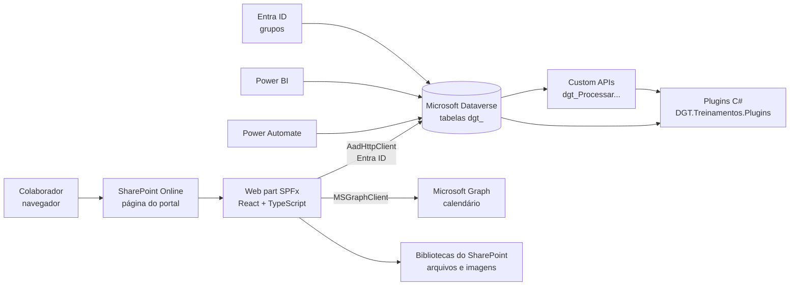

# Portal de Conhecimento e Treinamentos DGT

Plataforma corporativa de **gestão de treinamentos, conhecimento e documentos** da DGT, construída sobre o Microsoft 365 (SharePoint Online + SPFx) com dados no **Microsoft Dataverse**.

Centraliza em um só lugar: treinamentos e trilhas de aprendizagem, avaliações, certificados, validade e reciclagem, gestão documental com revisões, retreinamento por revisão de documento, acompanhamento por gestores, indicadores e auditoria completa.

> **Regra fundamental do projeto: nunca apagar histórico.** Atribuições, tentativas, notas, certificados e revisões de documentos são preservados. Treinamentos e registros são **desativados**, não excluídos. A única exceção é a remoção de treinamentos que nunca foram atribuídos a ninguém.

---

## Sumário

1. [Funcionalidades](#1-funcionalidades)
2. [Perfis de acesso](#2-perfis-de-acesso)
3. [Arquitetura](#3-arquitetura)
4. [Tecnologias e versões](#4-tecnologias-e-versões)
5. [Estrutura do repositório](#5-estrutura-do-repositório)
6. [Modelo de dados (Dataverse)](#6-modelo-de-dados-dataverse)
7. [Plugins e Custom APIs](#7-plugins-e-custom-apis)
8. [Segurança](#8-segurança)
9. [Ambiente de desenvolvimento](#9-ambiente-de-desenvolvimento)
10. [Configuração](#10-configuração)
11. [Build, versão e publicação](#11-build-versão-e-publicação)
12. [Implantação dos plugins](#12-implantação-dos-plugins)
13. [Scripts de apoio](#13-scripts-de-apoio)
14. [Regras de negócio e convenções](#14-regras-de-negócio-e-convenções)
15. [Solução de problemas](#15-solução-de-problemas)
16. [Roadmap](#16-roadmap)
17. [Histórico de versões](#17-histórico-de-versões)
18. [Gerar Executável](#18-Gerar-Executável)

---

## 1. Funcionalidades

### Treinamentos (colaborador)
| Recurso | Descrição |
|---|---|
| **Visão geral** | Resumo do colaborador: concluídos, em andamento, pendentes e trilhas. |
| **Meus treinamentos** | Treinamentos atribuídos e liberados, com progresso. |
| **Execução** | Módulos com conteúdos (texto, cards, destaques, vídeo, material, link) e perguntas rápidas. |
| **Avaliação** | Banco de questões com sorteio, embaralhamento, tempo limite, tentativas e nota mínima. Correção feita no servidor. |
| **Certificados** | Emitidos após a aprovação, com validade. |
| **Trilhas** | Sequência de treinamentos com ordem e pré-requisitos. |

### Gestão de treinamentos
| Recurso | Descrição |
|---|---|
| **Criar / editar treinamento** | Fluxo guiado em 3 etapas: treinamento → módulos → avaliação. Código gerado automaticamente (`ÁREA-TRN-SEQUENCIAL`). |
| **Importar treinamento (JSON)** | Importa módulos e avaliação gerados a partir de ITs e POPs. |
| **Catálogo** | Todos os treinamentos criados, em cartões. |
| **Modo de teste** | Percorre o treinamento e a avaliação **como um colaborador**, sem gravar nada e sem gerar certificado. |
| **Atribuir treinamento** | **Por área** (todos os membros, inclusive quem entrar depois) ou **por pessoa**. |
| **Gerenciar trilhas** | Treinamentos, ordem, pré-requisitos e áreas da trilha. |
| **Histórico do treinamento** | Linha do tempo de tudo o que mudou no treinamento e na sua estrutura: quem, quando, antes e depois. |
| **Remover treinamento** | Somente Administrador, e somente treinamentos nunca atribuídos e fora de trilhas. |
| **Áreas e acessos** | Áreas, vínculo de usuários às áreas, perfil na área e perfil no portal. |

### Documentos
| Recurso | Descrição |
|---|---|
| **Visão geral** | Documentos por área, pendências, favoritos, busca e filtros. |
| **Novo documento** | Cadastro de POP, IT, política, norma, manual etc. (Editor, Gestor e Administrador). |
| **Revisões** | Elaboração → revisão → aprovação → vigência. Uma revisão nunca substitui o histórico. |
| **Retreinamento** | Ao publicar uma revisão, o sistema pergunta "Esta revisão exige retreinamento?". Se sim, gera atribuições com origem *Revisão documental*. |
| **Histórico do documento** | Todas as ações do fluxo ficam registradas. |

### Acompanhamento
| Recurso | Descrição |
|---|---|
| **Minha equipe** | Progresso, pendências e vencimentos da equipe (Gestor). |
| **Conformidade** | Concluídos, pendentes e vencidos por área e por treinamento. |
| **Indicadores** | Área para os relatórios do Power BI. |

### Plataforma
- **Versão do portal** visível no cabeçalho (selo `vX.Y.Z`), com a tela **Novidades**.
- **Diagnóstico de acesso**, que explica os erros de conexão com o Dataverse.

---

## 2. Perfis de acesso

O portal usa **dois níveis de perfil**, independentes entre si:

| Nível | Onde fica | Para que serve |
|---|---|---|
| **Perfil no portal** | `dgt_usuario.dgt_perfilacesso` | Define as telas liberadas no portal inteiro. |
| **Perfil na área** | `dgt_usuarioarea.dgt_perfilarea` | Vale só naquela área. Exemplo: o Gestor **da área** aprova os documentos dela. |

### Perfil no portal

| Perfil | Pode |
|---|---|
| **Funcionário** | Fazer os próprios treinamentos e avaliações, e consultar documentos e certificados. |
| **Editor** | Tudo do Funcionário, e ainda criar e editar treinamentos, módulos, avaliações, trilhas, documentos e revisões (enviando para aprovação). **Não** aprova, **não** atribui, **não** vê equipe nem indicadores e **não** administra acessos. |
| **Gestor** | Tudo do Funcionário, e ainda equipe, atribuições, conformidade, indicadores e criação de documentos. Aprova documentos das áreas em que é **Gestor da área**. |
| **Administrador** | Tudo, incluindo Áreas e acessos, remoção de treinamentos e aprovação em qualquer área. |

### Rotas por perfil

| Rota | Funcionário | Editor | Gestor | Administrador |
|---|:-:|:-:|:-:|:-:|
| Início, Treinamentos, Trilhas, Documentos, Certificados, Avaliação | ✅ | ✅ | ✅ | ✅ |
| Novo documento | | ✅ | ✅ | ✅ |
| Gestão, Criar treinamento, Trilhas, Módulos, Avaliações, Gestão de documentos | | ✅ | | ✅ |
| Catálogo e Modo de teste | | ✅ | | ✅ |
| Minha equipe, Atribuir, Conformidade, Indicadores | | | ✅ | ✅ |
| Áreas e acessos, Remover treinamento | | | | ✅ |

As regras ficam em `services/RoutePermissionService.ts` (rotas) e `services/MenuPermissionService.ts` (abas).

> ⚠️ A tela **organiza** o acesso. A **proteção real dos dados** é feita pelas **funções de segurança do Dataverse** (seção 8). Sempre que mudar o perfil de alguém, ajuste **os dois**: o perfil no portal (em Áreas e acessos) e a função de segurança (no Dataverse).

---

## 3. Arquitetura



- **Frontend:** um único web part SPFx (`PortalTreinamentosWebPart`), com roteamento interno (`PortalRouter.tsx`). A aparência é de aplicação corporativa, sem o visual padrão do SharePoint.
- **Dados:** as informações estruturadas ficam no Dataverse. Os arquivos (documentos, PDFs e imagens de capa) ficam no SharePoint.
- **Regras críticas no servidor:** atribuição, correção de avaliação, reciclagem, revisão documental, geração de código, auditoria e atribuição por área rodam em **plugins** C#, e não só no navegador.
- **Identidade:** Microsoft Entra ID. O usuário do portal precisa existir no Dataverse (`systemuser`) e em `dgt_usuario`.

Fluxo principal:

```
Área / Grupo / Função → Usuário → Trilha → Treinamentos → Módulos → Avaliação
  → Conclusão → Certificado → Validade → Reciclagem / Retreinamento
```

---

## 4. Tecnologias e versões

| Camada | Tecnologia | Versão |
|---|---|---|
| Framework | SharePoint Framework (SPFx) | 1.22.2 |
| Build | Heft (`@rushstack/heft`) | ^1.2.7 |
| UI | React / React DOM | 17.0.1 |
| Linguagem | TypeScript | ~5.8.3 |
| Componentes | Fluent UI React | ^8.106 |
| Node.js | Node | **>= 22.14 e < 23** |
| Dados | Microsoft Dataverse (Web API v9.2) | — |
| Plugins | .NET Framework / C# | net462 · `Microsoft.CrmSdk.CoreAssemblies` 9.0.2.59 |
| Automação | Power Automate | — |
| Relatórios | Power BI | — |

> O SPFx deste projeto compila com a biblioteca **ES2015**. Funções mais novas, como `padStart`, não estão disponíveis. Antes de usar um recurso recente de JavaScript, confira se ele existe no ES2015; na dúvida, prefira `indexOf`, `Object.keys` e laços simples.

---

## 5. Estrutura do repositório

```
portal-treinamentos/
├── CHANGELOG.md                  Histórico de versões (fonte da tela "Novidades")
├── Gerar-Versao.ps1              Gera uma versão: incrementa, compila e empacota
├── README.md
├── package.json                  Scripts npm (build, start, versao)
├── config/
│   └── package-solution.json     Versão do pacote SharePoint e permissões de API
├── scripts/
│   └── versao.js                 Controle de versão (chamado pelo Gerar-Versao.ps1)
├── server/
│   └── DGT.Treinamentos.Plugins/ Plugins do Dataverse (C#)
├── sharepoint/solution/          (gerado) pacote .sppkg
├── teams/                        Ícones para uso no Teams
└── src/webparts/portalTreinamentosWebPart/
    ├── PortalTreinamentosWebPart.ts   Entrada do web part (URL do Dataverse)
    ├── components/
    │   ├── PortalTreinamentos.tsx     Layout, estado global e ações
    │   ├── PortalRouter.tsx           Roteamento das páginas
    │   └── common/                    Componentes reutilizáveis (ícones, versão, diagnóstico...)
    ├── constants/
    │   ├── routes.ts                  Lista de páginas (rotas)
    │   ├── moduleRoutes.ts            Páginas de cada módulo (Treinamentos e Documentos)
    │   ├── dataverseChoices.ts        Valores das colunas de escolha
    │   └── versao.ts                  (gerado) versão e novidades
    ├── hooks/                         Estado e carregamento por tela (useGestao..., useModulos...)
    ├── models/                        Tipos de domínio (Treinamento, Módulo, Avaliação...)
    ├── pages/
    │   ├── Inicio/  Intranet/         Tela inicial
    │   ├── Treinamentos/              Visão geral, meus treinamentos, execução, catálogo, modo de teste
    │   ├── Avaliacao/                 Avaliação do colaborador
    │   ├── Trilhas/  Certificados/  Historico/  Indicadores/  Suporte/
    │   ├── Documentos/                Home, detalhe, novo documento, revisões
    │   └── Gestao/                    Gestão de treinamentos, módulos, avaliações, trilhas,
    │                                  atribuição, áreas e acessos, conformidade, documentos
    ├── services/                      Acesso ao Dataverse e regras do portal
    │   ├── DataverseService.ts        Cliente da Web API (ponto único de acesso ao Dataverse)
    │   ├── AutorizacaoService.ts      Perfil do usuário logado e permissões
    │   ├── RoutePermissionService.ts  Permissão por rota
    │   ├── MenuPermissionService.ts   Abas visíveis por perfil
    │   └── ...AdminService.ts         Serviços de cada área de gestão
    └── utils/                         Formatação, fuso horário, diagnóstico, imagens do SharePoint
```

---

## 6. Modelo de dados (Dataverse)

Ambiente: **DGT – Automação Processos** · Solução: **DGT – Portal de Conhecimento e Treinamentos** · Prefixo: `dgt_`

### Pessoas e acesso
| Tabela | Conteúdo |
|---|---|
| `dgt_usuario` | Colaborador: nome, e-mail, UPN, Entra Object ID, ativo e **perfil no portal**. |
| `dgt_area` | Áreas (nome, sigla, ativa). A sigla compõe o código dos treinamentos. |
| `dgt_usuarioarea` | Vínculo usuário ↔ área e **perfil na área** (Membro, Gestor, Administrador da área). |
| `dgt_setor`, `dgt_funcao`, `dgt_grupo` | Estrutura organizacional e grupos. |
| `dgt_grupotrilha`, `dgt_funcaotrilha` | Público das trilhas por grupo e por função. |

### Treinamentos
| Tabela | Conteúdo |
|---|---|
| `dgt_treinamento` | Cadastro mestre: código, sequencial, área, tipo, carga horária, nota mínima, validade, imagem, ativo. |
| `dgt_modulo` | Módulos do treinamento (nome em `dgt_titulo`, ordem, obrigatório). |
| `dgt_moduloconteudo` | Conteúdos do módulo: texto, cards (`__DGT_CARDS__:[...]`), destaque, vídeo, material, link. |
| `dgt_modulopergunta`, `dgt_moduloperguntaalternativa`, `dgt_moduloperguntaresposta` | Perguntas rápidas dos módulos. |
| `dgt_avaliacao` | Configuração da avaliação: quantidade, nota, tentativas, tempo, sorteio, embaralhamento. |
| `dgt_questao`, `dgt_alternativa` | Banco de questões e alternativas, com gabarito e explicação. |
| `dgt_trilha`, `dgt_trilhatreinamento`, `dgt_trilhatreinamentoprerequisito`, `dgt_trilhaarea` | Trilhas, ordem, pré-requisitos e áreas. |
| `dgt_treinamentoarea` | **Regras de atribuição por área**: treinamento → área, prazo, ativo. |

### Execução e evidências (histórico do colaborador)
| Tabela | Conteúdo |
|---|---|
| `dgt_usuariotreinamento` | Atribuição: status, origem, datas, nota, validade, revisão treinada, certificado. |
| `dgt_usuariotrilha`, `dgt_usuariomodulo` | Progresso em trilhas e módulos. |
| `dgt_tentativa`, `dgt_tentativaquestao`, `dgt_resposta` | Tentativas de avaliação, questões apresentadas e respostas. |
| `dgt_certificado` | Certificados emitidos. |

### Documentos
| Tabela | Conteúdo |
|---|---|
| `dgt_documento` | Identidade permanente do documento: código, título, tipo, área, responsável. |
| `dgt_documentorevisao` | Cada revisão: arquivo, motivo, alterações, **requer retreinamento**, aprovação, vigência. |
| `dgt_treinamentodocumento` | Vínculo treinamento ↔ documento. |
| `dgt_revisaoimpacto` | Usuários impactados pela revisão. |
| `dgt_documentoprocesso`, `dgt_documentosetor`, `dgt_processo` | Classificação dos documentos. |

### Auditoria
| Tabela | Conteúdo |
|---|---|
| `dgt_auditorianegocio` | Histórico de negócio de documentos e treinamentos: ação, usuário, data, dados antes e depois. |
| `dgt_erroautomacao` | Erros registrados pelas automações. |

---

## 7. Plugins e Custom APIs

Projeto: `server/DGT.Treinamentos.Plugins` (assembly **DGT.Treinamentos.Plugins**, assinado com `.snk`, executado em sandbox).

| Plugin | Acionamento | Função |
|---|---|---|
| `ProcessarAtribuicaoPlugin` | Custom API `dgt_ProcessarAtribuicao` | Cria ou reaproveita atribuições, evita duplicidade, respeita conclusões válidas e a sequência da trilha, e libera o treinamento. |
| `ProcessarAvaliacaoPlugin` | Custom API `dgt_ProcessarAvaliacao` | Corrige a avaliação no servidor e registra tentativa, conclusão e validade. Libera o próximo treinamento. |
| `ProcessarReciclagemPlugin` | Custom API `dgt_ProcessarReciclagem` | Gera reciclagens de treinamentos vencidos ou próximos do vencimento. |
| `ProcessarRevisaoDocumentoPlugin` | Custom API `dgt_ProcessarRevisaoDocumento` | Publica a revisão, avalia o impacto e gera os retreinamentos. |
| `ObterDadosCertificadoPlugin` | Custom API | Monta os dados do certificado para a geração do PDF. |
| `GerarCodigoTreinamentoPlugin` | `dgt_treinamento`: Create (Pre, síncrono) e Update de `dgt_sequencial`/`dgt_codigo` (Pre, síncrono) | Gera o código `ÁREA-TRN-SEQUENCIAL`. Só o Administrador altera o sequencial, e não pode haver sequencial repetido na área. |
| `AuditarTreinamentoPlugin` | Create/Update/Delete (Post, **assíncrono**) em 10 tabelas do treinamento | Grava o histórico completo do treinamento em `dgt_auditorianegocio`. |
| `AtribuirPorAreaPlugin` | `dgt_treinamentoarea` e `dgt_usuarioarea` (Post, **assíncrono**) | Atribui o treinamento a todos os membros da área, inclusive a quem entrar depois. |

Todas as Custom APIs recebem `PayloadJson` (texto JSON) e devolvem `ResultadoJson`.

---

## 8. Segurança

### Camadas
1. **Entra ID:** autenticação. O portal usa o token do usuário logado (`AadHttpClient`).
2. **Dataverse:** o usuário precisa existir como `systemuser` habilitado, com licença adequada e **funções de segurança**.
3. **Portal:** registro ativo em `dgt_usuario` e perfil no portal.

### Funções de segurança (Dataverse)

Todas as pessoas recebem **Usuário Básico** mais a função do seu perfil:

| Função | Resumo dos privilégios nas tabelas `dgt_` |
|---|---|
| **DGT - Treinamentos - Funcionario** | Ler as tabelas de referência (treinamentos, módulos, documentos, `dgt_usuario`, `dgt_area` e `dgt_usuarioarea` em nível Organização). Registros pessoais conforme a estratégia de propriedade. |
| **DGT - Treinamentos - Editor** | Além do anterior, Criar/Gravar (Organização) nas tabelas de conteúdo: treinamentos, módulos, conteúdos, perguntas, avaliações, questões, alternativas, trilhas, documentos e revisões. |
| **DGT - Treinamentos - Gestor** | Além do Funcionário, Criar/Gravar em atribuições, documentos e `dgt_treinamentoarea`. |
| **DGT - Treinamentos - Administrador** | Criar/Ler/Gravar em todas as tabelas `dgt_`. **Excluir** apenas nas tabelas de conteúdo do treinamento, para o "Remover treinamento". |

**Excluir = Nenhum** para todas as funções em `dgt_usuariotreinamento`, `dgt_tentativa`, `dgt_certificado` e `dgt_auditorianegocio`.

A recomendação é conceder as funções por **Group Teams** do Dataverse ligados a grupos do Entra ID (`DGT Treinamentos – Colaboradores`, `– Gestores` e `– Administradores`). Assim não é preciso administrar as permissões usuário por usuário.

### Permissões de API do SPFx
As permissões são declaradas em `config/package-solution.json` → `webApiPermissionRequests` e aprovadas em **Centro de administração do SharePoint → Avançado → Acesso à API**:

| Recurso | Escopo | Uso |
|---|---|---|
| Dataverse (Dynamics CRM) | `user_impersonation` | Leitura e gravação no Dataverse em nome do usuário. |
| Microsoft Graph | `Calendars.Read` | Eventos do calendário na tela inicial. |

> A aprovação vale para **todo o tenant**, porque é concedida ao aplicativo compartilhado de extensibilidade do SPFx.

### Dados pessoais (LGPD)
- Não armazene CPF, CNPJ, senhas ou dados bancários em conteúdos, módulos ou documentos do portal.
- Os relatórios gerados pelos scripts de diagnóstico contêm e-mails e IDs. Trate-os como dados pessoais e apague-os após o uso.
- Chaves e segredos nunca vão para o código nem para o Git.

---

## 9. Ambiente de desenvolvimento

### Pré-requisitos
- **Node.js 22.14 ou superior, na versão 22.x** (`node -v`).
- **Git**.
- **.NET SDK**, para compilar os plugins (`dotnet --version`).
- **PowerShell 7** (recomendado), para os scripts de apoio.
- Acesso ao tenant Microsoft 365 da DGT e ao ambiente Dataverse.
- Plugin Registration Tool (`pac tool prt` ou XrmToolBox), apenas para o primeiro registro do assembly.

### Instalação
```powershell
git clone https://github.com/Doug-13/DGT-Portal-Treinamentos.git
cd DGT-Portal-Treinamentos\portal-treinamentos
npm install
```

### Rodar localmente
```powershell
npm start
```
Depois, abra o workbench hospedado do site de desenvolvimento e adicione o web part **Portal Treinamentos**:
```
https://<tenant>.sharepoint.com/sites/<site>/_layouts/15/workbench.aspx
```

---

## 10. Configuração

### URL do Dataverse
A URL fica em `src/webparts/portalTreinamentosWebPart/PortalTreinamentosWebPart.ts`:
```ts
'https://orga1bd9fe9.api.crm2.dynamics.com/api/data/v9.2'
'https://orga1bd9fe9.crm2.dynamics.com'
```
Para outro ambiente (homologação ou produção), altere essas URLs **e** o recurso em `webApiPermissionRequests`.

### Cadastro de um novo usuário
1. O usuário existe e está habilitado no Entra ID, com uma licença que inclua o Dataverse.
2. O usuário está sincronizado no ambiente (Power Platform admin center → Usuários → Adicionar usuário) **ou** é membro de um Group Team.
3. Funções atribuídas: **Usuário Básico** + **DGT - Treinamentos - <Perfil>**.
4. Existe um registro em `dgt_usuario` com e-mail, UPN e Entra Object ID iguais aos do Entra ID, e Ativo = Sim.
5. O usuário está vinculado a pelo menos uma área (Gestão → Áreas e acessos), com o **Perfil no portal** definido.

### Imagens dos treinamentos
Use o **endereço direto** do arquivo (biblioteca → "…" → Detalhes → Caminho). A imagem deve estar em uma biblioteca que **todos os colaboradores possam ler**, com caminho curto (o limite é de 500 caracteres). Links de compartilhamento (`/:i:/…`) não funcionam. Links `AllItems.aspx?id=…` são convertidos automaticamente.

---

## 11. Build, versão e publicação

### Build do dia a dia (não muda a versão)
```powershell
npm run build
# ou
npx heft build --production
```

### Gerar uma versão para publicar
```powershell
.\Gerar-Versao.ps1              # 1.0.4 → 1.0.5
.\Gerar-Versao.ps1 -Tipo minor  # 1.0.4 → 1.1.0
.\Gerar-Versao.ps1 -Tipo major  # 1.0.4 → 2.0.0
.\Gerar-Versao.ps1 -Git         # também faz o commit e cria a tag vX.Y.Z
```
O script:
1. incrementa a versão em `package.json` e em `config/package-solution.json` (`X.Y.Z.0`);
2. move as anotações de `## [Não publicado]` do `CHANGELOG.md` para a nova versão;
3. gera o `constants/versao.ts` (selo e tela **Novidades**);
4. compila e empacota;
5. copia `DGT-Portal-Treinamentos_vX.Y.Z.sppkg` para a pasta **Downloads**;
6. se algo falhar, **restaura a versão anterior**.

### Anotar mudanças
Durante o desenvolvimento, registre cada mudança no `CHANGELOG.md`:
```markdown
## [Não publicado]

- Novo: descrição da funcionalidade.
- Melhoria: descrição do ajuste.
- Correção: descrição do erro corrigido.
```

### Publicar no SharePoint
1. SharePoint Admin Center → **Mais recursos → Aplicativos → Catálogo de Aplicativos**.
2. **Carregar** o `.sppkg` → **Substituir** → **Implantar**.
3. No site: Conteúdo do site → aplicativo → **Detalhes** → **Obter a versão mais recente** (se a opção aparecer).
4. Abra o portal com **Ctrl+F5** e confira o selo `vX.Y.Z` no cabeçalho.

> O console do navegador (F12) mostra `[Portal DGT] versão ... · build ... · commit ...`. Se o número não mudou, o SharePoint ainda está servindo o pacote antigo.

---

## 12. Implantação dos plugins

1. Compile:
   ```powershell
   cd server\DGT.Treinamentos.Plugins
   dotnet build -c Release
   ```
2. Atualize o assembly e registre tipos, steps e imagens (processo automatizado):
   ```powershell
   .\Implantar-Plugins.ps1 -HabilitarLog
   ```
   O script é idempotente: cria apenas o que falta. Se houver um tipo registrado que não existe mais na DLL, ele para e indica a limpeza.
3. O **primeiro** registro do assembly (Register New Assembly) é feito uma única vez pelo Plugin Registration Tool.

Steps registrados:

| Plugin | Tabela | Mensagem | Estágio / Modo | Imagens |
|---|---|---|---|---|
| GerarCodigoTreinamento | dgt_treinamento | Create | Pre · Síncrono | — |
| GerarCodigoTreinamento | dgt_treinamento | Update (`dgt_sequencial`, `dgt_codigo`) | Pre · Síncrono | — |
| AuditarTreinamento | 10 tabelas do treinamento | Create / Update / Delete | Post · Assíncrono | Post / Pre+Post / Pre |
| AtribuirPorArea | dgt_treinamentoarea | Create · Update (`dgt_ativo`) | Post · Assíncrono | Post |
| AtribuirPorArea | dgt_usuarioarea | Create · Update (`dgt_ativo`, `dgt_area`) | Post · Assíncrono | Post |

As falhas dos steps assíncronos aparecem em **Configurações → Trabalhos do Sistema**. O log de rastreamento fica em **Personalização → Log de rastreamento de plug-in**.

---

## 13. Scripts de apoio

Scripts PowerShell de administração, com login interativo e sem senhas. A recomendação é mantê-los em uma pasta `ferramentas/` do repositório.

| Script | Função |
|---|---|
| `Gerar-Versao.ps1` | Gera uma versão do portal (seção 11). |
| `Implantar-Plugins.ps1` | Compila e implanta plugins, steps e imagens. |
| `Criar-TabelaTreinamentoArea.ps1` | Cria a tabela `dgt_treinamentoarea`, com colunas, relações e permissões. |
| `Diagnostico-AcessoPortal.ps1` | Diagnóstico completo de acesso de um usuário: Entra ID, licença, Dataverse, funções, cadastro e simulação. Somente leitura. |
| `Validar-AcessosPortal-Lote.ps1` | Valida e corrige em lote o acesso de vários usuários. |
| `Remover-GeracaoQuestoesIA.ps1` | Remove os componentes da geração de questões com IA (funcionalidade adiada). |

Scripts baixados precisam ser liberados antes da primeira execução:
```powershell
Get-ChildItem *.ps1 | Unblock-File
```

---

## 14. Regras de negócio e convenções

### Código do treinamento
- Formato **`ÁREA-TRN-SEQUENCIAL`** (ex.: `PRO-TRN-001`), gerado no servidor.
- O sequencial é **por área**: o próximo é o maior sequencial da área + 1. Números vagos não são reaproveitados, e treinamentos inativos também contam.
- Somente o **Administrador** altera o sequencial depois da criação. O código é recalculado, e a alteração vai para o histórico.
- O tipo do treinamento é fixo (**TRN**) na tela.

### Atribuições
- Origens: Individual, Grupo (inclui a atribuição por área), Função, Reciclagem, Revisão documental e Mudança de função.
- Treinamentos concluídos e ainda válidos são reaproveitados. Nunca há duplicidade para a mesma origem.
- Mudar de área, grupo ou função **não apaga** as atribuições anteriores.

### Validade × revisão documental
- **Validade vencida** → **reciclagem**.
- **Documento vinculado revisado** com "exige retreinamento" → **retreinamento por revisão documental**, mesmo que o treinamento ainda esteja válido. A revisão anterior continua no histórico.

### Remoção
- Treinamentos: só podem ser removidos se **nunca foram atribuídos** e estão **fora de trilhas**. Nos demais casos, **desative**.
- Nenhum outro registro de colaborador é excluído.

### Código-fonte
- Alterações em arquivos são entregues **completas**, e não em fragmentos.
- Todo acesso ao Dataverse passa pelo `DataverseService`.
- O nome do conjunto de cada tabela é obtido com `getEntitySetName` (não fixe o plural).
- Os textos da interface são em português do Brasil.

---

## 15. Solução de problemas

| Sintoma ou erro | Causa provável | Solução |
|---|---|---|
| `403 · 0x80072560 · The user is not a member of the organization` | O usuário não existe ou está desabilitado no Dataverse, não tem licença ou está fora do grupo de segurança do ambiente. | Adicione ou sincronize o usuário no ambiente e confira a licença e o grupo. Use `Diagnostico-AcessoPortal.ps1`. |
| "Seu usuário não está cadastrado no Portal" | Não há registro em `dgt_usuario`, **ou** o usuário não consegue lê-lo. | Crie o registro. Na função Funcionário, dê **Ler = Organização** em `dgt_usuario`, `dgt_area` e `dgt_usuarioarea`. |
| `0x80040220 · missing prv...` | Falta um privilégio na função de segurança. | A mensagem indica o privilégio e a tabela (ex.: `prvCreatedgt_Treinamento`). Ajuste a função. |
| O perfil mudou no portal, mas nada muda | O perfil no portal está diferente da função de segurança, ou a página não foi recarregada. | Ajuste os dois e recarregue (Ctrl+F5). |
| O portal mostra a versão antiga, e as correções não aparecem | O SharePoint está servindo o pacote antigo em cache, ou a versão não foi incrementada. | Gere com `Gerar-Versao.ps1`, publique com **Substituir** e use Ctrl+F5. Confira o selo e o console. |
| Editar um treinamento cria cópias | Uma versão antiga do portal está publicada. | Publique a versão atual. |
| Imagem de capa com ⚠ | O link é de compartilhamento ou de página, ou a imagem está em um site sem permissão de leitura. | Use o endereço direto, em uma biblioteca pública do portal. |
| `400 · dgt_imagemurl exceeded 500` | O link da imagem é muito longo. | Use o endereço direto (sem `?viewid=…`) ou um caminho mais curto. |
| `404 · 0x80060888 · Resource not found for the segment` | A Custom API ou a tabela não existe, ou tem outro nome. | Confira o nome exato (maiúsculas contam) e publique as personalizações. |
| Uma janela (modal) aparece no canto da página | Uso de `position: fixed` dentro do SharePoint. | Renderize a janela com `ReactDOM.createPortal(..., document.body)`. |
| Script `.ps1` "não está assinado digitalmente" | O arquivo foi baixado da internet. | Rode `Unblock-File .\script.ps1`. |
| Build: `padStart does not exist` | Uso de função ES2017 com a biblioteca ES2015. | Use uma alternativa compatível. |

---

## 16. Roadmap

Prioridades em andamento e futuras:

- [ ] Automações Power Automate: entrada em grupo, conclusão, vencimento e inclusão de treinamento em trilha.
- [ ] Geração do certificado em PDF, com a identidade visual da DGT.
- [ ] Painel do gestor completo e indicadores do Power BI incorporados.
- [ ] Validação no servidor da aprovação de revisões (somente Gestor da área ou Administrador).
- [ ] Registros pessoais com propriedade do colaborador (leitura apenas dos próprios registros).
- [ ] Comunicados do RH na tela inicial, a partir do Teams (*adiado*).
- [ ] Geração de questões de avaliação com IA (*adiado*; o código está preservado na branch `upgrade/questoes-ia`).
- [ ] Testes completos do fluxo e publicação para uso real.

---

## 17. Histórico de versões

Consulte o [CHANGELOG.md](CHANGELOG.md). No portal, clique no selo de versão no cabeçalho → **Novidades do portal**.

---

## 18. Gerar Executável

# ============================================================
# Gera o pacote SharePoint (.sppkg) do Portal DGT
#
# NÃO muda o número da versão. Para gerar uma nova versão, use
# o Gerar-Versao.ps1.
# ============================================================

$ErrorActionPreference = 'Stop'

cd C:\DGT\DGT-Portal-Treinamentos\portal-treinamentos

# 1. Limpar pastas geradas (evita arquivos antigos no pacote e nos testes)
Remove-Item -Recurse -Force lib, lib-commonjs, temp, dist, release -ErrorAction SilentlyContinue

# 2. Atualizar versao.ts com o CHANGELOG.md
#    (mantém a versão; leva os itens de "Não publicado" para a tela de Novidades)
node scripts/versao.js none

if ($LASTEXITCODE -ne 0) {
    throw "Erro ao atualizar as novidades (scripts/versao.js). Processo interrompido."
}

# 3. Compilar a versão de produção
npx heft build --production

if ($LASTEXITCODE -ne 0) {
    throw "Erro na compilação. Processo interrompido."
}

# 4. Gerar o pacote SharePoint
npx heft package-solution --production

if ($LASTEXITCODE -ne 0) {
    throw "Erro ao gerar o pacote."
}

# 5. Copiar o pacote para Downloads
$Origem = ".\sharepoint\solution\DGT-Portal-Treinamentos.sppkg"

$Destino = "$env:USERPROFILE\Downloads\DGT-Portal-Treinamentos.sppkg"

Copy-Item $Origem $Destino -Force

Write-Host "Pacote gerado: $Destino" -ForegroundColor Green

---

**DGT – Automação de Processos** · Uso interno.